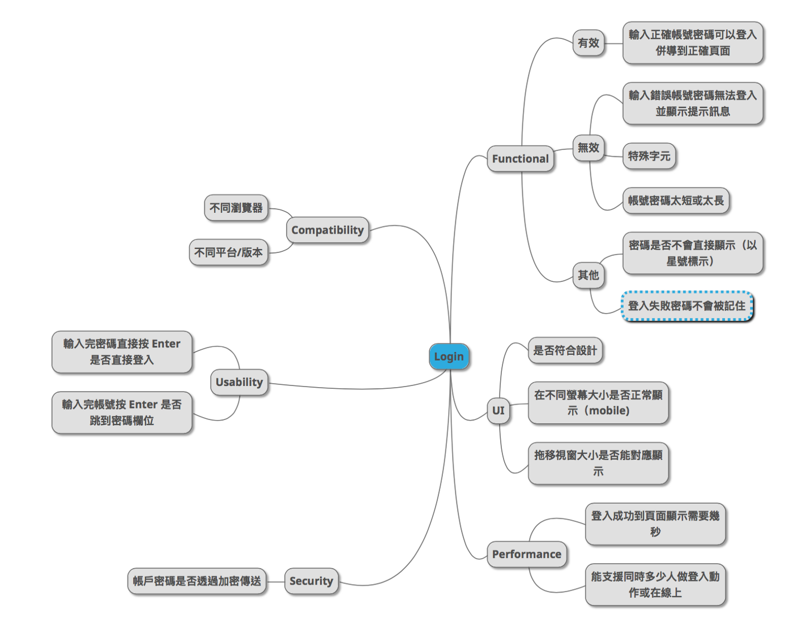

# Test Methodology

## Black-Box Test Technique (黑盒测试方法) (Focus on 等价类和边界值)
**Black Box Testing** is a software testing method in which the functionalities of software applications are tested **without** having knowledge of internal code structure, implementation details and internal paths. Black Box Testing mainly focuses on `input` and `output` of software applications and it is entirely based on software requirements and specifications

**1、等价类划分 (Equivalance Partitioning):**

It divides the **input data** of software into different equivalence data classes.
You can apply this technique, where there is a **range** in the **input** field.

- To reduce the number of test cases to a necessary minimum.
- To select the right test cases to cover all possible scenarios.

**Example:**

    For the input 'month':
    >> Invalid Partition 1: ... -2, -1, 0
    >> Valid Partition:  1, 2 ... 11, 12
    >> Invalid Partition 2: 13, 14 ...

**2、边界值分析方法 (Boundary Value Analysis)**

Boundary value analysis is based on testing at the **boundaries between partitions**.

**Example:**

    Input condition is valid between 1 to 10
    >> Boundary values 0,1,2 and 9,10,11

3、因果图方法

4、正交实验设计方法

5、功能图分析方法

**6、错误推测法 (Error Guessing)**

7、需求文档转化法

**8、随机测试 (Random Testing)**

9、对象属性分析法
## White-box test method (白盒测试方法)
1.语句覆盖：就是设计若干个测试用例，运行被测程序，使得每一可执行语句至少执行一次。

2.判定覆盖：使设计的测试用例保证程序中每个判断的每个取值分支至少经历一次。

3.条件覆盖：条件覆盖是指选择足够的测试用例，使得运行这些测试用例时，判定中每个条件的所有可能结果至少出现一次，但未必能覆盖全部分支

4.判定条件覆盖：判定 - 条件覆盖就是设计足够的测试用例，使得判断中每个条件的所有可能取值至少执行一次，同时每个判断的所有可能判断结果至少执行，即要求各个判断的所有可能的条件取值组合至少执行一次。

5.条件组合覆盖：在白盒测试法中，选择足够的测试用例，使所有判定中各条件判断结果的所有组合至少出现一次，满足这种覆盖标准成为条件组合覆盖。

6.路径覆盖：是每条可能执行到的路径至少执行一次。

补充：
（1）语句覆盖在所有的测试方法中是一种最弱的覆盖。
（2）判定覆盖和条件覆盖比语句覆盖强，满足判定/条件覆盖标准的测试用例一定也满足判定覆盖、条件覆盖和语句覆盖
（3）路径覆盖也是一种比较强的覆盖，但未必考虑判定条件结果的组合，并不能代替条件覆盖和条件组合覆盖。
## Test Case Design
#### 功能用例 Functional
Back to test techniques: Equivalance Partition, BVA, ...
#### UI
#### 兼容性 Compatibility (app 版本,操作系统版本,不同移动设备分辨率)

#### 性能 Performance (单用户的响应时间,高并发,长时间多用户登陆)

#### 安全性 Security (加密,多设备登陆的互斥)
#### 可用性,易用性 Usability (全键盘输入,enter,tab)

**Example**: Log in module

## Stress Test
Ensure that the software applications should be able to handle the workload well with increased performance